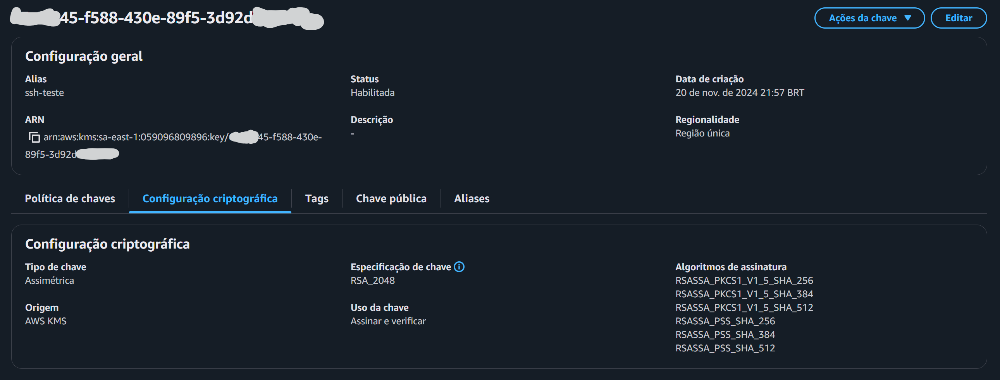

[](https://github.com/mvrpl/kssh/actions/workflows/main.yaml)
[](https://dependabot.com/)
[](https://github.com/mvrpl/windows-apps/blob/main/bucket/kssh.json)
[](https://github.com/mvrpl/unix-apps/blob/main/Formula/kssh.rb)


# SSH client with AWS KMS

## Installation
### With Go
```sh
go install github.com/mvrpl/kssh@latest
```
### MS Windows
```sh
scoop bucket add mvrpl https://github.com/mvrpl/windows-apps
scoop install mvrpl/kssh
```
### Unix
```sh
brew tap mvrpl/unix-apps https://github.com/mvrpl/unix-apps
brew install kssh
```
---
You can set AWS KMS resource ID or Alias:

    export KSSH_KEY=63c5fc45-f568-430e-89f5-3t92d7491f5e

Supported Cloud AWS KMS:



## Support

    Linux, Mac OS and Microsoft Windows

## authorized_key

Print public key:

    kssh --authorized_key
    ecdsa-sha2-nistp256 AAAAzzz

You can copy the public key to ~/.ssh/authorized_keys in your home directory on the remote machine.

## ssh login

    kssh username@hostname

## usage

    kssh --help
